# `rspyai`([demo](https://bsky.app/profile/alternatebuild.dev/post/3lde7ougics2k))

A [Textual](https://github.com/textualize/textual/) app to explore your Rust codebase.


> [!NOTE]
> This is a [personal project](https://blog.alternatebuild.dev/explore-a-rust-project-in-a-tui-with-ai/). It might break for some reason.

<details>
<summary>overview</summary>

```
.
├── Cargo.toml
├── pyproject.toml
├── python
│   └── rspyai
│       ├── __init__.py
│       ├── __pycache__
│       ├── models
│       │   ├── __pycache__
│       │   └── function_summary.py
│       ├── rspyai.pyi
│       ├── settings.py
│       ├── tui.py
│       └── widgets
│           ├── __pycache__
│           ├── function_details.py
│           ├── function_summary.py
│           └── function_tree.py
├── src
│   ├── function.rs
│   ├── lib.rs
│   ├── sample.rs
│   └── scanner.rs
└── uv.lock
```




```mermaid
flowchart TB
    subgraph Rust["Rust Backend (via PyO3)"]
        Scanner["ProjectScanner"]
        RustFunc["RustFunction"]
        Scanner -->|extracts| RustFunc
        Debug["Debug Utils"]
        
        subgraph RustAPI["Python-exposed API"]
            scan["scan_rust_project()"]
            meta["get_function_metadata()"]
        end
        
        Scanner --> scan
        Scanner --> meta
        RustFunc --> scan
        RustFunc --> meta
    end

    subgraph Python["Python Frontend"]
        subgraph TUI["Textual UI Components"]
            FuncBrowser["FunctionBrowser (Main App)"]
            FuncTree["FunctionTree Widget"]
            FuncDetails["FunctionDetails Widget"]
            FuncSummary["FunctionSummary Widget"]
            
            FuncBrowser -->|contains| FuncTree
            FuncBrowser -->|contains| FuncDetails
            FuncDetails -->|contains| FuncSummary
        end
        
        subgraph Settings["Configuration"]
            Config["Settings (pydantic)"]
            AIConfig["AI Model Settings"]
            Config --> AIConfig
        end
        
        subgraph AI["AI Integration"]
            Agent["pydantic-ai Agent"]
            Summary["Function Summaries"]
            Agent -->|generates| Summary
        end
    end

    RustAPI -->|exposes functions to| Python
    FuncTree -->|calls| scan
    FuncDetails -->|calls| meta
    FuncSummary -->|uses| Agent
    AIConfig -->|configures| Agent

    style Rust fill:#deb887
    style Python fill:#4682b4
    style TUI fill:#2f4f4f
    style AI fill:#556b2f
```

This project combines Rust and Python via [`pyo3`](https://pyo3.rs/v0.23.3/) and [`maturin`](https://www.maturin.rs/tutorial) to provide a Textual-based TUI that explores Rust codebases, highlighting public functions for potential Python exposure.

1. **Rust Backend**:  
   - **`src/scanner.rs`**: Recursively scans a Rust project directory, identifying `.rs` files and extracting public functions using `syn` and `walkdir`.  
   - **`src/function.rs`**: Defines `RustFunction` and logic for parsing signatures, documentation, and source code.  
   - **`src/lib.rs`**: Exposes `scan_rust_project` and `get_function_metadata` as Python-callable functions via `PyO3`.

2. **Python Frontend**:  
   - **`rspyai` Python package**:  
     - **`rspyai/__init__.py`**: Imports Rust-implemented functions as `scan_rust_project` and `get_function_metadata`.  
     - **`rspyai/tui.py`**: Implements the `FunctionBrowser` TUI using [Textual](https://github.com/textualize/textual). This app:
       - Scans and displays a tree of Rust functions.  
       - Shows detailed metadata (signature, doc, source) in a split-pane layout.  
       - Integrates with `pydantic-ai` to generate AI-based summaries of selected functions.  
     - **`rspyai/widgets/*`**: Modular widgets for tree navigation, details display, and AI-generated summaries.
   - **`pyproject.toml` and `Cargo.toml`**: Configure Python (with `maturin`) and Rust builds, specifying dependencies and linking the Rust `cdylib` as a Python extension.

3. **AI Integration**:  
   - **`pydantic-ai`** used to streamline calling LLMs.  
   - Queries about functions are sent to a chosen AI model to stream summaries of the selected function.

4. **Settings**:  
   - **`rspyai/settings.py`**: Defines settings for the TUI and AI that allow:
     - setting the ai model
     - setting the system prompt used by the ai model
     - TODO (add more settings)

</details>


## requirements

- [uv](https://docs.astral.sh/uv/) to bootstrap a python environment
- an api key for an [LLM provider supported by `pydantic-ai`](https://ai.pydantic.dev/models/) that supports streaming responses

> [!IMPORTANT]
> by default, `rspyai` uses `openai:gpt-4o` and requires an `OPENAI_API_KEY` set in your environment.

## usage

```bash
# start the function browser 
uvx rspyai@latest

# start the function scanner at a specific path
uvx rspyai@latest [path_to_rust_project]

# start the function browser using a different ai model
RSPYAI_AI_MODEL=ollama:qwen2.5 uvx rspyai@latest
```

### interactive TUI

the TUI provides:
- function tree browser
- information on each function: signature, docstring, parent file, etc.
- ai-generated summaries with AI agent summary (`pydantic-ai`)

https://github.com/user-attachments/assets/7fd118c1-3587-4ddc-8aec-a18d88e38f04

## development

```bash
# Clone the repository
git clone https://github.com/zzstoatzz/rspyai.git
cd rspyai

# Install development dependencies
uv sync --dev --all-extras

# Rebuild the pyo3 extension
maturin develop

# Run your local copy of the app
rspyai
```
